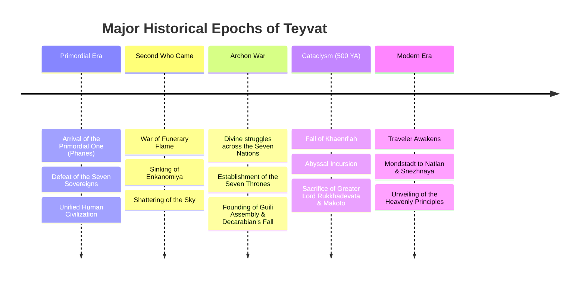

# 📜 Thrilling Tales — Teyvat Interactive Timeline

[](https://pages.github.com/)
[](https://genshin.hoyoverse.com/)
[](LICENSE)

An interactive, chronological timeline designed to make the deep and sprawling lore of **Teyvat (Genshin Impact)** easily discoverable, searchable, and interconnected.

---

## 🌟 The Problem & Vision

Genshin Impact possesses one of the most intricately constructed fantasy world histories in modern gaming. However, its lore is notoriously fragmented across:
- **Weapon Lore & Artifact Descriptions** (e.g., *Deepwood Memories*, *Thundering Fury*, *Staff of Homa*)
- **In-Game Books & Relics** (e.g., *Before Sun and Moon*, *The Byakuyakoku Collection*, *Perinheri*)
- **World Quests & Hidden Exploration Objectives** (e.g., *Narzissenkreuz Ordo*, *Aranyaka*, *Gourmet Supremos*)
- **Limited-Time Events** (events that new players can no longer experience in-game)
- **Character Voice-Lines and Character Stories**

**Thrilling Tales** brings these disparate fragments together into a unified, interactive chronological visualizer. Rather than reading disconnected wiki articles, users can follow the rise and fall of civilizations, gods, and factions across the flow of Teyvat's history.

---

## 🗺️ Core Eras of Teyvat

The timeline is structured around canonical eras and historical milestones:



---

## 🚀 Features & Architecture

- [x] **Dedicated Interactive Horizontal Timeline**: Proportional horizontal axis with Era bands, ruler ticks, and chronological milestone nodes.
- [x] **Hover Quick-Preview**: Instant floating tooltip preview with thumbnail, era, date, and summary on node hover.
- [x] **Click to Pin Inspector**: Pin any milestone into a dedicated slide-out inspector drawer that stays open during exploration.
- [x] **Multi-Image Carousel**: Each event supports a full image carousel with captions, slide controls, and indicator dots.
- [x] **Rich Lore Categorization & Citations**: Region, character, faction tags, spoiler warnings, and verbatim in-game citations.
- [x] **Era Fast Jumpers & Live Search**: Jump between canonical eras and instantly filter milestones by keyword, character, or nation.
- [x] **Zero-Build GitHub Pages Hosting**: Native HTML5, modern CSS, and ES modules with relative path resolution for subfolder deployment.

---

## 📂 Repository Structure

```text
.
├── .github/
│   └── workflows/
│       └── deploy.yml       # GitHub Actions automated deployment to GitHub Pages
├── .gitignore               # Ignored files (system, IDE, build artifacts)
├── .nojekyll                # Disables Jekyll processing on GitHub Pages
├── README.md                # Project documentation and roadmap
├── AGENTS.md                # AI agent operating instructions & lore guidelines
├── data/                    # Structured canonical lore datasets
│   ├── eras.json            # Canonical eras definition, time ranges, and color themes
│   └── events.json          # Rich chronological milestones with carousel images & citations
├── docs/                    # Technical & architectural specifications
│   ├── architecture.md      # Data pipeline, rendering engine & client architecture
│   ├── lore-schema.md       # JSON/YAML data format specification for events
│   └── deployment.md        # GitHub Pages subfolder deployment guide
├── index.html               # Main interactive horizontal timeline application
├── timeline/                # Subpage redirect for backward compatibility
│   └── index.html           # Redirects to root timeline
└── assets/                  # Shared static web assets
    ├── css/
    │   └── style.css        # Thematic styles (horizontal track, inspector, carousel)
    └── js/
        └── main.js          # Interactive horizontal timeline engine & controllers
```

---

## 💻 Local Development

Because this project is built as a zero-dependency static web application, no compilation or npm installations are required to get started.

### Running with Python (Recommended)
```bash
# Clone the repository
git clone https://github.com/Biodam/thrilling-tales.git
cd thrilling-tales

# Start a local static file server
python3 -m http.server 8080
```
Then visit:
- **Landing Page**: [http://localhost:8080/](http://localhost:8080/)
- **Timeline Subpage**: [http://localhost:8080/timeline/](http://localhost:8080/timeline/)

### Running with Node / npx
```bash
npx serve . -l 8080
```

---

## 🌐 Live GitHub Pages Deployment (Subfolder Hosting)

The project is deployed and live on **GitHub Pages**:
- **Root Landing Page**: [https://biodam.github.io/thrilling-tales/](https://biodam.github.io/thrilling-tales/)
- **Interactive Timeline Subpage**: [https://biodam.github.io/thrilling-tales/timeline/](https://biodam.github.io/thrilling-tales/timeline/)

Continuous deployment is handled automatically via GitHub Actions on every push to `main` using `.github/workflows/deploy.yml`.

> **Note on Relative Paths**: All asset references and internal links use explicit relative paths (`./` and `../`), ensuring that the site functions flawlessly regardless of whether it is hosted at domain root or inside any repository subfolder.

For detailed deployment configuration and optional GitHub Actions workflows, refer to [`docs/deployment.md`](docs/deployment.md).

---

## 📚 Documentation

- [System Architecture](docs/architecture.md)
- [Lore Data Schema](docs/lore-schema.md)
- [Deployment Guide](docs/deployment.md)
- [AI Contributor Guidelines](AGENTS.md)

---

## 📜 Disclaimer & Credits

*Genshin Impact* is a registered trademark of **COGNOSPHERE PTE. LTD. / miHoYo**. All in-game lore, character names, and lore excerpts belong to miHoYo. This project is a non-commercial, fan-made open-source tool created for educational and community lore exploration.
